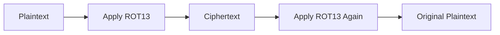
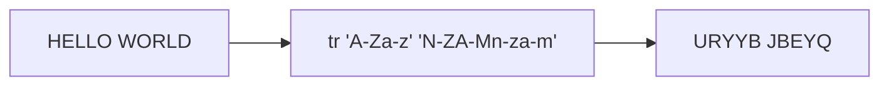

# ROT13 Cipher 

## Overview

ROT13 (Rotate by 13) is a simple substitution cipher that replaces each letter in the English alphabet with the letter located 13 positions ahead. It is a special case of the Caesar Cipher, which shifts characters by a fixed number of positions.

Because the English alphabet contains 26 letters, a shift of 13 divides the alphabet into two equal halves. Applying ROT13 twice restores the original text, making the algorithm self-inverse.

```text
HELLO → URYYB
URYYB → HELLO
```

> **Important:** ROT13 is not considered secure encryption. It is primarily used for educational purposes, puzzles, and text obfuscation.

---

## Prerequisites

Before working with ROT13, you should understand:

- Basic text processing concepts
- The English alphabet (A–Z)
- Basic Linux command-line usage (optional)
- Fundamental understanding of Caesar ciphers

---

## Environment / Setup

### Linux Environment

ROT13 can be performed using the standard Linux `tr` command, which translates characters from one set into another.

Verify that `tr` is available:

```bash
which tr
```

Expected output:

```text
/usr/bin/tr
```

---

## Concepts

### What Is a Caesar Cipher?

A Caesar Cipher shifts alphabetic characters by a fixed number of positions.

Example with a shift of 3:

```text
A → D
B → E
C → F
```

ROT13 is simply a Caesar Cipher with a shift value of 13.

---

### How ROT13 Works

The alphabet is rotated by half its length.

```text
ABCDEFGHIJKLMNOPQRSTUVWXYZ
NOPQRSTUVWXYZABCDEFGHIJKLM
```

Each letter maps directly to its counterpart.

#### Transformation Flow



---

### Why ROT13 Is Unique

Most encryption systems require separate encryption and decryption operations.

ROT13 uses the same operation for both encryption and decryption.

```text
ROT13(ROT13(Text)) = Text
```

Example:

```text
HELLO
↓ ROT13
URYYB
↓ ROT13
HELLO
```

---

### Character Position Representation

ROT13 represents letters using values from 0 to 25.

| Letter | Value |
|---------|--------|
| A | 0 |
| B | 1 |
| C | 2 |
| ... | ... |
| M | 12 |
| N | 13 |
| ... | ... |
| Z | 25 |

---

### Mathematical Formula

| Operation | Formula |
|------------|---------|
| Encryption | `E(x) = (x + 13) mod 26` |
| Decryption | `D(x) = (x + 13) mod 26` |

Because the alphabet contains 26 letters, applying a shift of 13 twice returns the original value.

---

## Character Mapping Reference

### Uppercase Letters

| Original | ROT13 |
|-----------|--------|
| A | N |
| B | O |
| C | P |
| D | Q |
| E | R |
| F | S |
| G | T |
| H | U |
| I | V |
| J | W |
| K | X |
| L | Y |
| M | Z |
| N | A |
| O | B |
| P | C |
| Q | D |
| R | E |
| S | F |
| T | G |
| U | H |
| V | I |
| W | J |
| X | K |
| Y | L |
| Z | M |

### Lowercase Letters

| Original | ROT13 |
|-----------|--------|
| a | n |
| b | o |
| c | p |
| d | q |
| e | r |
| f | s |
| g | t |
| h | u |
| i | v |
| j | w |
| k | x |
| l | y |
| m | z |
| n | a |
| o | b |
| p | c |
| q | d |
| r | e |
| s | f |
| t | g |
| u | h |
| v | i |
| w | j |
| x | k |
| y | l |
| z | m |

---

## Step-by-Step Procedure

### Example 1: Encrypting Text

#### Plaintext

```text
HELLO
```

#### Character Conversion

| Original | ROT13 |
|-----------|--------|
| H | U |
| E | R |
| L | Y |
| L | Y |
| O | B |

#### Result

```text
HELLO → URYYB
```

---

### Example 2: Decrypting Text

#### Ciphertext

```text
URYYB
```

#### Character Conversion

| Cipher | Plain |
|---------|--------|
| U | H |
| R | E |
| Y | L |
| Y | L |
| B | O |

#### Result

```text
URYYB → HELLO
```

---

## Linux Implementation Using `tr`

### Understanding the Command

```bash
tr 'A-Za-z' 'N-ZA-Mn-za-m'
```

### Command Breakdown

| Component | Description |
|------------|-------------|
| `tr` | Translates characters |
| `A-Z` | Matches uppercase letters |
| `a-z` | Matches lowercase letters |
| `N-ZA-M` | ROT13 mapping for uppercase letters |
| `n-za-m` | ROT13 mapping for lowercase letters |

The command reads text from standard input (`stdin`), translates matching characters, and writes the result to standard output (`stdout`).

---

### Encrypting Text

#### Command

```bash
echo "HELLO WORLD" | tr 'A-Za-z' 'N-ZA-Mn-za-m'
```

#### Output

```text
URYYB JBEYQ
```

#### Process Flow



---

### Decrypting Text

Because ROT13 is self-inverse, the same command performs decryption.

#### Command

```bash
echo "URYYB JBEYQ" | tr 'A-Za-z' 'N-ZA-Mn-za-m'
```

#### Output

```text
HELLO WORLD
```

---

### Decoding a File

#### Command

```bash
tr 'A-Za-z' 'N-ZA-Mn-za-m' < encrypted.txt
```

#### Explanation

1. Reads data from `encrypted.txt`.
2. Applies ROT13 translation.
3. Prints the decoded content to the terminal.

---

## Verification / Validation

### Test 1: Verify Reversibility

```bash
echo "HELLO" | tr 'A-Za-z' 'N-ZA-Mn-za-m'
```

Output:

```text
URYYB
```

Apply ROT13 again:

```bash
echo "URYYB" | tr 'A-Za-z' 'N-ZA-Mn-za-m'
```

Output:

```text
HELLO
```

**Result:** Applying ROT13 twice restores the original text.

---

### Test 2: Verify Character Preservation

Input:

```text
Hello, World! 123
```

Output:

```text
Uryyb, Jbeyq! 123
```

Observation:

- Alphabetic characters are translated.
- Numbers remain unchanged.
- Punctuation remains unchanged.
- Spaces remain unchanged.

---

## Common Use Cases

ROT13 is not intended for security. It is commonly used for:

- Hiding spoilers
- Obscuring puzzle solutions
- Basic CTF challenges
- Educational cryptography demonstrations
- Temporarily hiding text from casual readers

### Example: CTF Flag

Encoded text:

```text
Gur synt vf synt{uryyb_jbeyq}
```

Decoded text:

```text
The flag is flag{hello_world}
```

---

## Security Considerations

ROT13 provides **no meaningful cryptographic security**.

### Limitations

| Issue | Explanation |
|---------|-------------|
| Fixed Shift | Only one possible shift exists |
| Public Algorithm | Universally known |
| Instant Reversal | Same operation decrypts the text |
| No Secret Key | No key management involved |
| Vulnerable to Analysis | Frequency patterns remain visible |

### Security Assessment

```text
ROT13 = Obfuscation
ROT13 ≠ Secure Encryption
```

Anyone familiar with ROT13 can reverse the transformation instantly using standard tools.

---

## Troubleshooting

### Command Produces No Output

Verify that input is provided:

```bash
echo "HELLO" | tr 'A-Za-z' 'N-ZA-Mn-za-m'
```

---

### Incorrect Character Translation

Ensure the translation sets are exactly:

```text
A-Za-z
N-ZA-Mn-za-m
```

Any modification will produce different results.

---

### Numbers and Symbols Are Not Changing

This is expected behavior.

ROT13 only affects alphabetic characters.

Example:

```text
Input : HELLO123!
Output: URYYB123!
```

---

## Examples

### Example 1

Input:

```text
HELLO
```

Output:

```text
URYYB
```

### Example 2

Input:

```text
NETWORK
```

Output:

```text
ARGJBEX
```

### Example 3

Input:

```text
security
```

Output:

```text
frphevgl
```

---

## Notes

- ROT13 operates only on alphabetic characters.
- Non-alphabetic characters are preserved.
- The cipher is deterministic.
- No secret key is required.
- Encryption and decryption use the same transformation.

---

## Key Takeaways

- ROT13 is a Caesar cipher with a shift value of 13.
- The alphabet is rotated halfway through its length.
- Encryption and decryption are identical operations.
- Applying ROT13 twice restores the original text.
- Linux provides an easy implementation using the `tr` command.
- ROT13 is useful for learning cryptography concepts and solving simple puzzles.
- ROT13 should never be used to protect sensitive information.

---

## Key Concepts Learned

- Caesar Cipher fundamentals
- Character substitution techniques
- Alphabet rotation
- Modular arithmetic (`mod 26`)
- Symmetric transformations
- Linux text processing with `tr`
- Encoding vs. encryption
- Cryptographic limitations of classical ciphers
- Verification and decoding workflows
